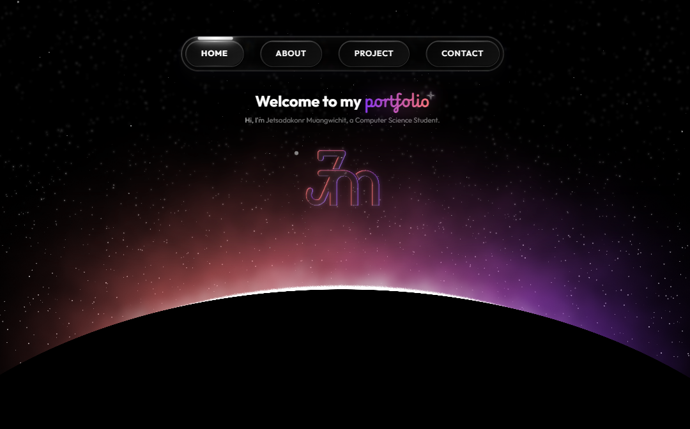

# 🌌 7sadakonr Portfolio

A modern, responsive portfolio website showcasing my work and skills. Built with React and featuring a stunning universe-themed design.



## ✨ Features

- **🎨 Glass Morphism UI** - Beautiful translucent glass effect design
- **🌟 Universe Theme** - Animated twinkling stars and shooting stars background
- **🖱️ Interactive Magnifier** - Zoom into project images with a liquid glass lens effect
- **📱 Mobile Optimized** - Fully responsive design optimized for all devices
- **🎭 Smooth Animations** - Elegant transitions and animations throughout
- **⚡ Fast Performance** - Built with Vite for lightning-fast load times

## 🛠️ Tech Stack

| Technology | Description |
|------------|-------------|
| **React 19** | Frontend framework |
| **Vite** | Build tool & dev server |
| **React Router** | Client-side routing |
| **GSAP** | Animation library |
| **Three.js** | 3D graphics |
| **CSS** | Custom styling with glass morphism |

## 📁 Project Structure

```
src/
├── assets/           # Images, icons, and static assets
├── components/       # Reusable UI components
│   ├── Animation/    # Animation wrappers
│   ├── Loading/      # Loading screen component
│   ├── Navbar/       # Navigation bar
│   └── hero-section/ # Hero section component
├── pages/            # Page components
│   ├── Home.jsx      # Landing page
│   ├── About.jsx     # About me page
│   ├── Project.jsx   # Project showcase
│   └── Contact.jsx   # Contact page
└── App.jsx           # Main app component
```

## 🚀 Getting Started

### Prerequisites

- Node.js 18+ 
- npm or yarn

### Installation

1. Clone the repository
```bash
git clone https://github.com/7sadakonr/7sadakonr-portfolio.git
cd 7sadakonr-portfolio
```

2. Install dependencies
```bash
npm install
```

3. Start the development server
```bash
npm run dev
```

4. Open [http://localhost:5173](http://localhost:5173) in your browser

### Build for Production

```bash
npm run build
```

## 🌐 Live Demo

Visit the live site: [https://7sadakonr-portfolio.vercel.app](https://7sadakonr-portfolio.vercel.app)

### Home Page
- Hero section with animated gradient text
- Universe-themed background with twinkling stars
- Smooth scroll navigation

### About Page
- Personal introduction
- Skills showcase with glass buttons
- Resume download feature

### Projects Page
- Interactive project cards
- Image magnifier with liquid glass effect
- Tech stack badges

## 📄 License

This project is dual-licensed:

1.  **Source Code**: The code is licensed under the **MIT License**. You are free to use, modify, and distribute it as long as you include the original copyright notice.
2.  **Content & Assets**: The images, personal data, and text content are licensed under **Creative Commons Attribution-NonCommercial-ShareAlike 4.0 International (CC BY-NC-SA 4.0)**. This means you cannot use them for commercial purposes without permission.

---
&copy; 2025 Jetsadakorn Muangwichit. All Rights Reserved.


## 📬 Contact

- **GitHub**: [@7sadakonr](https://github.com/7sadakonr)
- **Portfolio**: [7sadakonr-portfolio.vercel.app](https://7sadakonr-portfolio.vercel.app)

---

## Developed By

**7sadakonr**
