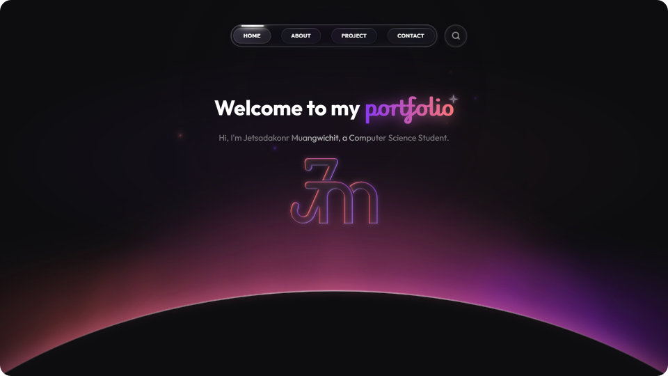

# 7sadakonr Portfolio

A modern, responsive portfolio website showcasing my work and skills. Built with React and TypeScript, featuring a stunning universe-themed design, smooth animations, and a rich glass-morphism aesthetic.



## Features

- **Glass Morphism UI** - Beautiful translucent glass effect design
- **Universe Theme** - Animated background with auroras, shooting stars, and a glowing planet
- **Command Menu** - Fast global navigation via `⌘K` or `Ctrl+K` shortcuts
- **Interactive Magnifier** - Zoom into project images with a liquid glass lens effect
- **Text Reveal Animations** - Smooth text stagger and character swap transitions
- **Mobile Optimized** - Fully responsive design tailored for all devices
- **Fast Performance** - Built with Vite, React Lazy Loading, and optimized rendering
- **Analytics** - Integrated with Vercel Analytics

## Tech Stack

| Technology | Description |
|------------|-------------|
| **React 19** | Frontend framework |
| **TypeScript** | Static typing for JavaScript |
| **Vite** | Build tool & fast dev server |
| **React Router** | Client-side routing |
| **GSAP** | Advanced animation library |
| **Three.js** | 3D graphics and rendering |
| **CSS Modules / CSS** | Custom styling with glass morphism and hardware acceleration |

## Project Structure

```
src/
├── assets/           # Images, icons, CSS files, and static assets
├── components/       # Reusable UI components
│   ├── Animation/    # Animation wrappers and Fireflies effect
│   ├── CommandMenu/  # Global command palette
│   ├── GlassSurface/ # Glass-morphism containers
│   ├── Navbar/       # Navigation bar and indicator
│   └── SpaceBackground/ # Universe-themed background components
├── pages/            # Page components
│   ├── HeroPage.tsx  # Landing page
│   ├── AboutPage.tsx # About me page
│   ├── ProjectPage.tsx # Project showcase
│   └── ContactPage.tsx # Contact page
├── App.tsx           # Main app component (Lazy loading & Routing)
└── main.tsx          # Application entry point
```

## Getting Started

### Prerequisites

- Node.js 18+ 
- npm or yarn

### Installation

1. Clone the repository
```bash
git clone https://github.com/7sadakonr/7sadakonr-portfolio.git
cd 7sadakonr-portfolio
```

2. Install dependencies
```bash
npm install
```

3. Start the development server
```bash
npm run dev
```

4. Open [http://localhost:5173](http://localhost:5173) in your browser

### Build for Production

```bash
npm run build
```

## View Site

Visit the live site: [7sadakonr.xyz](https://7sadakonr.xyz)

### Home Page
- Hero section with animated gradient text and fireflies
- Universe-themed background with dynamic auroras
- Smooth scroll navigation

### About Page
- Personal introduction
- Skills showcase with glass buttons
- Resume download feature

### Projects Page
- Interactive project cards
- Image magnifier with glass effect
- Tech stack badges

### Contact Page
- Glass-morphism contact form
- Social media links and direct contact info

## License

This project is dual-licensed:

1.  **Source Code**: The code is licensed under the **MIT License**. You are free to use, modify, and distribute it as long as you include the original copyright notice.
2.  **Content & Assets**: The images, personal data, and text content are licensed under **[Creative Commons Attribution-NonCommercial-ShareAlike 4.0 International (CC BY-NC-SA 4.0)](https://creativecommons.org/licenses/by-nc-sa/4.0/)**. This means you cannot use them for commercial purposes without permission.

---

&copy; 2025 Jetsadakorn Muangwichit. All Rights Reserved.

## Contact

- **GitHub**: [@7sadakonr](https://github.com/7sadakonr)
- **Portfolio**: [7sadakonr.xyz](https://7sadakonr.xyz)

---

## Developed By

**7sadakonr**
